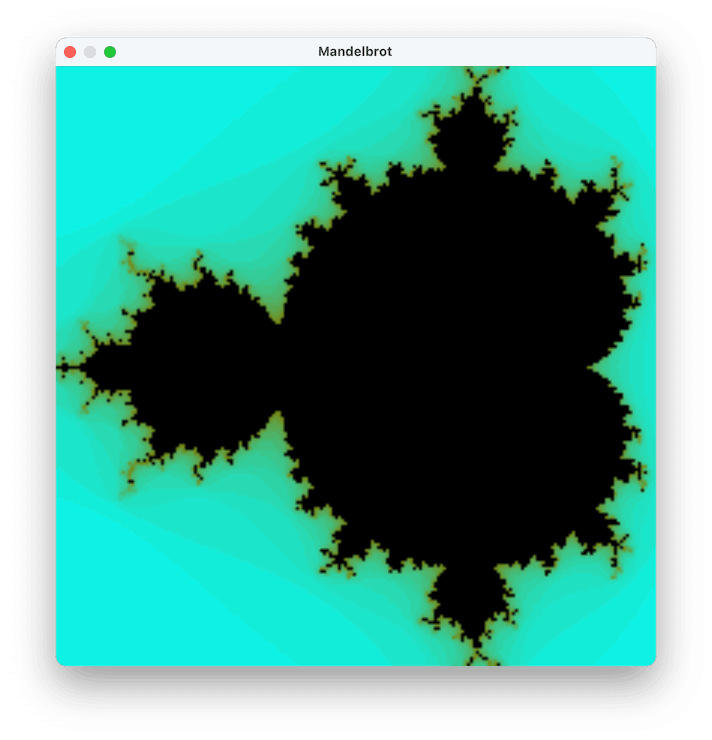

# Smalltalk Mandelbrot



Mandelbrot fractal implementation in Smalltalk using Cocoa bindings. 

Supported on macOS using GNU Smalltalk.

## Usage

This program is written for [GNU Smalltalk](https://www.gnu.org/software/smalltalk/). The GNU implementation of Smalltalk was chosen due to its resemblance to Smalltalk-80 and excellent support for C interopability. You can install GNU Smalltalk from their website or through Homebrew.

In order to interact with Cocoa APIs, a collection of C-functions have been written to be called from Smalltalk. These are found in the *GSTCocoa* directory and need to be compiled to a library before you can run Mandelbrot.st.

> **Note:** GSTCocoa links against Cocoa, so this will only work on macOS.

### Instructions

Follow the instructions below to compile GSTCocoa and run the fractal program.

#### 1. Compile GSTCocoa

- Make sure you have `clang` and `make` on your Mac. If you have Xcode, you’re good to go.
- Run `make` from the repository directory, or from the *GSTCocoa* directory.

#### 2. Run the program
- Make sure you have [GNU Smalltalk](https://www.gnu.org/software/smalltalk/).
- Run `gst Mandelbrot.st` or `make run` from the repository directory.

## About the implementation

This program consists of three parts:

- **GSTCocoa** A small library that contains logic to interact with Cocoa windows and views (NSWindow, NSImageView, etc.).
- **ComplexNumber.st** A class representing a complex number.
- **Mandelbrot.st** The fractal implementation.

The subchapters below look at each part in detail.

### GSTCocoa

GSTCocoa contains the classes `CocoaApplication`, `CocoaWindow`, `CocoaView`, `CocoaImageView`, and `CoreGraphicsContext`.

These are the bare minimum of classes needed to render the Mandelbrot fractal in a window. The methods implemented in each class are also the fewest needed for this program. 

Class and method names are chosen to fit the conventions of Smalltalk, and to make a clear distinction between the actual Cocoa APIs. Therefore, the class prefix “Cocoa-” is chosen instead of “NS-”.

Most methods in GSTCocoa call a C-function. The C-function may do more than one thing to reduce the number of necessary C-call outs. For example, `CocoaApplication start` makes an autorelease pool, a shared application instance, and tells the application to terminate after the last window closes:

```objective-c
// Create a memory pool that will be drained upon release.
autoreleasePool = [[NSAutoreleasePool alloc] init];

// Create the shared application instance backing NSApp.
[NSApplication sharedApplication];

appDelegate = [[GSTCocoaAppDelegate alloc] init];
[NSApp finishLaunching];
[NSApp setDelegate:appDelegate];
```

For the C-call outs to work, GSTCocoa expects *libGSTCocoa.dylib* at *GSTCocoa/lib*. This library is produced using `make`. More information is given in [Compile GSTCocoa](#1-compile-gstcocoa).

### ComplexNumber.st

The ComplexNumber class represents a complex number in rectangular form. You can ask about its real and imaginary parts, and its magnitude and argument.

Supported operations are addition and exponentiation using the methods `+` and `raisedTo:` respectively. These are the minimum set of operations needed to implement a Mandelbrot fractal.

### Mandelbrot.st

Mandelbrot.st is the enty-point of the program. The code in this file does the following:

#### Defines constants used later in the program

```smalltalk
width := 200.
height := 200.
windowScale := 3.
components := 4.
iterations := 20.
power := 2.
translation := Point x: -0.5 y: 0.
```

#### Makes a new Cocoa window

```smalltalk
application := CocoaApplication start.
window := application makeWindowOfWidth: windowScale * width andHeight: windowScale * height.
window title: 'Mandelbrot'.
```

#### Adds an image view to the window

```
imageView := CocoaImageView x: 0 y: 0 width: windowScale * width height: windowScale * height.
imageView imageScaling: CocoaImageView scaleAxesIndependently.
imageView autoresizingMask: (CocoaView widthSizable) + (CocoaView heightSizable).
(window contentView) addSubview: imageView.
```

#### Calculates the values of the fractal at each point in the image

```smalltalk
imageData := ByteArray new: (components * width * height).

(0 to: height - 1) do: [ :y | 
    (0 to: width - 1) do: [ :x |
        "..."
    ]
]
```

#### Displays the fractal as an image

```smalltalk
context := CoreGraphicsContext width: width height: height.
context updateFromByteArray: imageData.
imageView image: (context image).
```

## Developing GSTCocoa

GSTCocoa can be extended to support a more full set of classes and methods in Cocoa. 

### Implementing a new class

- Write interface and implementations in *GSTCocoa/src* directory
- Include header in *gst-cocoa.h*
- Write Smalltalk implementation in *GSTCocoa* directory
- Read in Smalltalk implementation in *GSTCocoa.st*

### Supported make commands

| Command | Description |
|-|-|
|`make`| Compiles GSTCocoa|
|`make clean`| Cleans the build directores |
|`make run`| Shorthand for running Mandelbrot.st in gst |

## Contribution

Contributions are welcome and encouraged. Feel free to check out the project, submit issues and code patches.

Your feedback is of great value. Open an issue and let me know if you encounter any difficulties.
